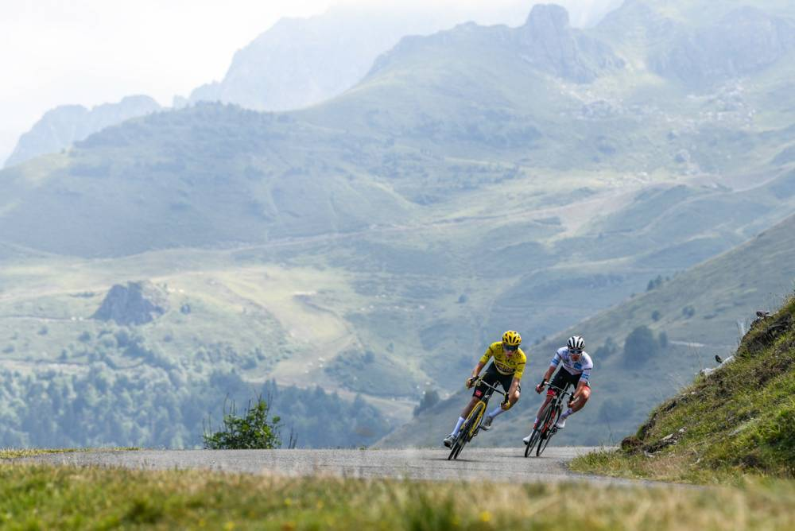
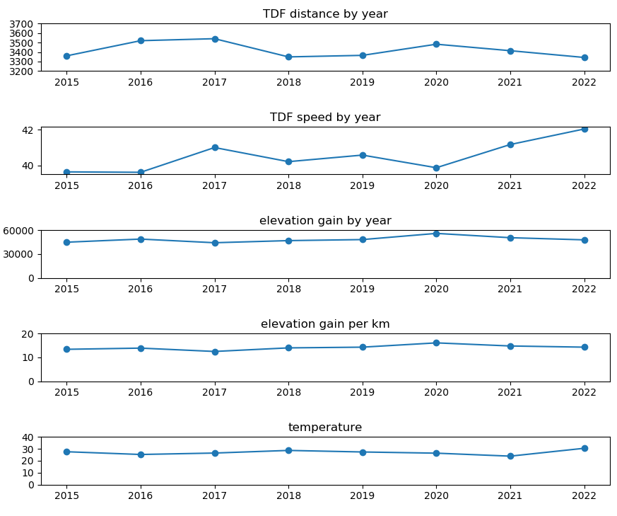
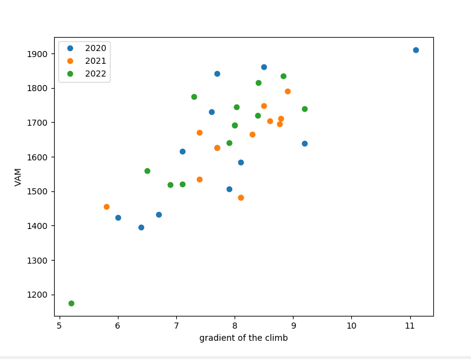
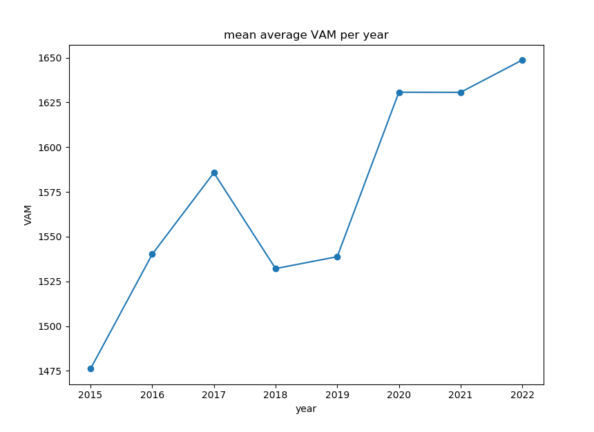
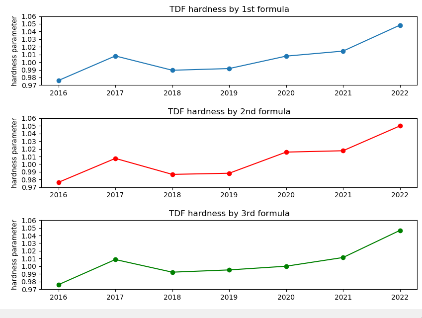

# Was the 2022 TDF the best ever?

"C'est le tour de france" 

The consesus now that the tour de france 2022 is over is that we watched the last three weeks one of the best tdf in terms of attractiveness for the spectators. Constant attacks from the capos of the peloton and the sense that nobody was really looking the powermeter and rather riding by heart and courage was constant stage after stage, reminding us of the romantic cycling of another era. But was it also as good athletically speaking? 

The goal of this article is to analyze wether the hardest multi-stage cycling race of the world was also this year the hardest in modern era. We are going to analyze hardness in regards to athletic performance. Ofcourse it would be interesting to compare it with much older tour de france editions however the different technological advances and lack of statistical data make this not possible. Older tdf's were usually harder in the pure meaning of the word:

*hard: with great exertion; with vigor or violence; strenuously*

Nevertheless in this article we will focus in the sense of hardness from a purely athletic point of view. This article can be made better by adding more data of older tdf's versions and just running the code. Feel free to do so.

## What is hardness in cycling?

Concretely in a multistage race such as the tour de france we usually understand hardness as the concatenation of hard stages, a stage can be said that it was tough/hard when some of the following criteria apply:
1. The longer a stage is the harder it is
2. The more elevation gain the harder
3. Extreme weather conditions make for a harder stage, whether cold or hot. Around 20 degrees is perfect for cycling practice
4. The faster a stage it has been ridden the harder it was
5. The more crosswind/headwind the harder, on the other hand tailwind makes it easier
6. The higher altitude the harder it is to ride a bike because of the lack of oxygen

## Criterias we are going to follow

Given the nature of the tour de france, ie. a 20 day stage race. We are going to focus in the criteria 1, 2, 3, 4. As the "Grande Boucle" is several days long the rest of the criteria may be considered not as important and additionally they are much harder to quantify and to get reliable data of them.

## Comparison

We have collected data of the tdf since the year 2015, for earlier editions data was lacking, especially the climbing perfomances. It would be especially interesting to see how the numbers compare to the ones of the EPO era. 

Observe how this years version was the fastest. Not only the last seven years, ever! This was also one of the hottest tdf remembered.

Next we plot the VAMS of the different climbs of the last 3 years. VAM stands for "velocità ascensionale media", translated in English means "average ascent speed". The term was coined by Italian physician and cycling coach Michele Ferrari, is the speed of elevation gain, usually stated in units of metres per hour and is very positively correlated with watts/kg a rider has to push during a climb.

As you can see the higher the gradient the higher the VAM tends to be, intuitively this is because a bigger proportion of the force is used against gravity and not so much against friction or air resistance as in not steep climbs.

Also, we chose climbs of at least 5km as shorter climbs tend have too high VAMS and depending on the tdf edition it can vary considerably the amount of these kind of climbs. For instance the lowest VAM corresponds to climb of the col de la croix de fer in this years version. The highest is from the 2020 version and happened in the climb of the Plateau des Glières a quite short (6km) and very steep climb.

For this climbing performances we based ourselves in the data from http://www.climbing-records.com/ and the twitter channel ammattipyöräily. Importantly we choose the climbing times of the winner of that year tdf for each climb. This should gives us a good estimate of the climbing performance

Finally we can plot the mean VAM of each tdf edition. That is a very good estimator of the climbing performance of a multi stage race as the tour.

## Putting all the ingredients together

We are going to define the the difficulty of a tour the france as a linear combination of the before mentioned metrics.

$TDF_{hardness} = \alpha \cdot normmean_{VAM} +  \beta \cdot norm_{distance} +  \gamma \cdot normmean_{Speed} + \delta \cdot normmean_{temp}$

we have chosen the following values:

 * (1) $\alpha = 0.45, \beta = 0.02, \gamma = 0.45, \delta = 0.08$
 * (2) $\alpha = 0.6, \beta = 0.02, \gamma = 0.3, \delta = 0.08$
 * (3) $\alpha = 0.3, \beta = 0.02, \gamma = 0.6, \delta = 0.08$

 note that: $\alpha + \beta + \gamma + \delta = 1$
 
A little comment on each formula, in (1) we equate the weight of the mean VAM and distance. On the second we give more weight to the VAM whereas in the third the other way around. The scalar factor of the distance is fairly small as it is usually quite steady and we don't believe is of much importance. The temperature in contrast is a litle higher.

Also, as seen in the formula we take each metric normalized, that is divided by its mean. This way if $TDF_{hardness} = 1$ it would mean it was a pretty average tour de france version, the higher the better or harder it was racen.

### Results

The results after applying the formulas to the different editions is the following;

From this we can infer that the 2017, 2018 and 2019 were pretty average versions in comparison with the rest. And this years versions was by all means the best.

## Conclusions

As we see from the results, the 2022 tour de france looks like clearly is the hardest or best in terms in performance we have seen, at least in the last 7 years. It was ridden the fastest ever in history and also its mean VAM its the highest in the recent times. It would be really interesting to get it compared with older versions, the EPO era or the Lance armstrong era to see how the riders nowadays performed in comparison to the enhanced older riders. Anyways seems like a good time to be a cycling fan.

Author: mario.moliner@gmail.com
